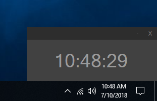
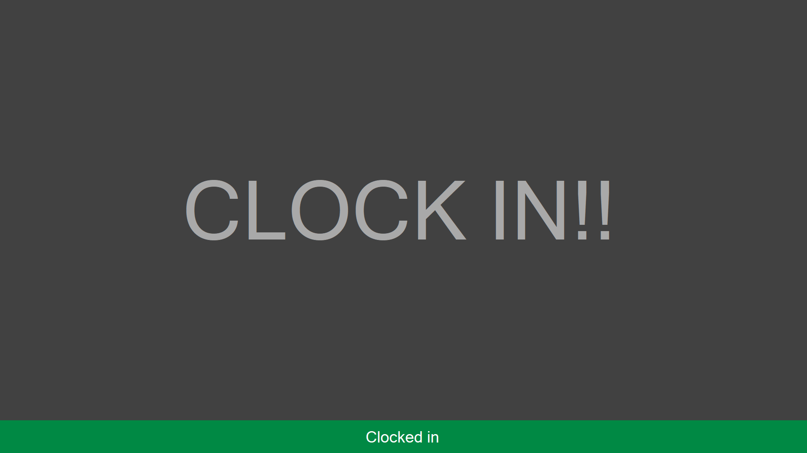

# ClockIn
Background Application I created to alert myself when I have been afk usually for lunch and need to clock in again. I get the coordinates of the mouse and after a few minutes test the location of the mouse again. If after 30 minutes the location of the mouse has not moved it is safe to say that I am afk so it alerts me when I come back to the computer. 

<h1> minimalist form </h1>

 Will minimize to system tray! 

  

<h1> Alert Screen </h1>

 Creates a new Alert form that maximizes itself. This shows up even if the computer is locked.  

  

